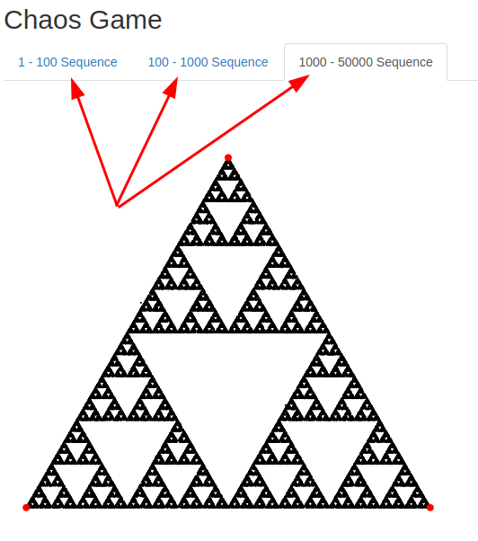
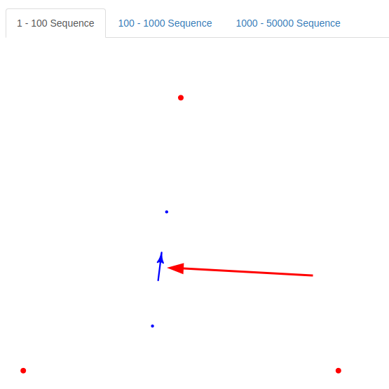
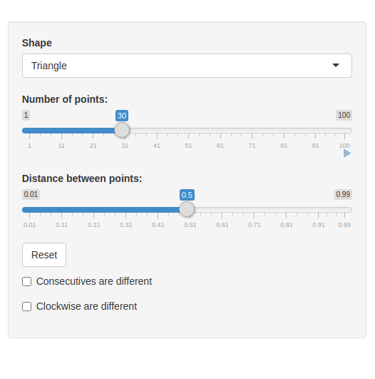
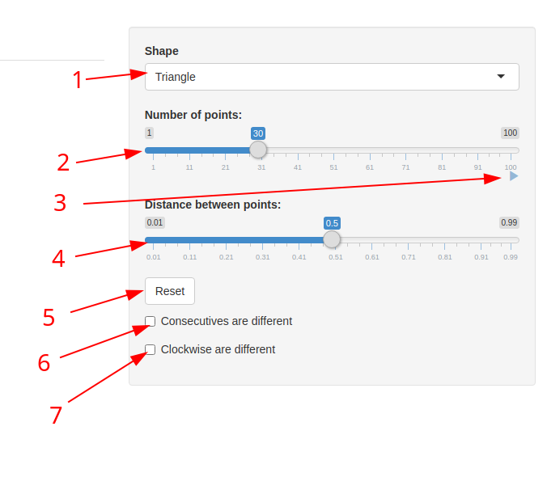

```{css, echo=FALSE}
.square-div {
    width: 500px;
    height: 500px;
}
```

<style type="text/css">
    h1.title {
      text-align: center;
    }
</style>

## Ce este "*Chaos Game*"?

In matematica, termenul chaos era initial folosit pentru a face referire la o metoda de a crea un fractal, incepand cu un poligon si un punct selectat aleatoriu in interiorul poligonului. Un fractal este creat iterativ, incepand de la punctul initial (care este ales aleatoriu), iar fiecare punct nou ales este la o distanta fractionala dintre punctul curent si unul dintre colturile poligonului, adica se afla pe segmentul dintre punctul curent si coltul selectat. Ceea ce uneori creaza un fractal este faptul ca directia catre care va indica urmatorul nod, adica coltul selectat este aleatoriu, ceea ce la o fractie specifica aplicata, punctele se pot repeta. Repetand acest proces de multe ori, se poate obtine, dar nu intotdeauna un fractal. 

## Cum se traduce acest lucru in programare? De ce avem nevoie?

 - Un vector de colturi ale poligonului
 - Un vector finit, generat aleatoriu continand elemente din vectorul poligonului
 - O fractie care va reprezenta distanta fractionala intre puncte
 - O metoda de a afisa punctele pe un plan 2d (in cazul de fata vom folosi package-urile R shiny)
 - Optional o animatie, care sa arate crearea fractalului. Considerand ca R shiny este reactive, acest lucru este simplu.

## Cum implementam in R shiny?

Vom folosi functia plot care, in cazul de fata vom genera punctele pe intervalul [0,1]
In primul rand avem nevoie de o functie care sa genereze toate datele necesare, depinzand de tipul poligonului. Vom lua ca exemplu un simplu triunghi.

1. In primul rand avem nevoie de cele 3 puncte ale triungului. Le vom retine intr-o matrice unde coloanele reprezinta indicele coltului, si cele 2 coordonate.
2. Bazandu-ne pe vectorul de mai sus generam un vector care ia ca valori aleatorii indicii punctelor triunghiurilor si dupa cream matricea care reprezinta coordonatele efective
    + variabila consec se refera sa nu existe 2 valori consecutive in generare. Functia generatoare:
    ```
        myRngConsec <- function (myLength = 50000, numb = c(1,3)) {
            y <- rep(NA, myLength)
            prev = 0
            for(i in 1:myLength){
                y[i] = sample(setdiff(numb, prev),1)
                prev = y[i]
            }
            return (y)
        }
    ```
    + variabila clock se refera ca urmatoarea selectata sa fie diferita de punctul care urmeaza din punct de vedere trigonometric. Functia generatoare:
    ```
    myRngClockwise<- function (myLength = 50000, numb = c(1,3)) {
        y <- rep(NA, myLength)
        prev = sample(numb, 1)
        y[1] = prev
        for(i in 2:myLength){
            diff = (1 + prev) %% length(numb) 
            if (diff == 0) {
                diff = length(numb)
            }
            y[i] = sample(setdiff(numb, diff),1)
            prev = y[i]
        }
        return (y)
    }
    ```
    + Exemplu de generare pentru 10 valori si distanta 1/2 (pe aplicatia R shiny primele 4 var sunt parametrii).
    ```{r}
    consec=FALSE
    clock=FALSE
    maxLength=10
    dist=1/2
    vertices <- matrix(NA, ncol = 3, nrow = 3) 
    vertices[1,] <- c(1, 0, 0)
    vertices[2,] <- c(2, 1, 0)
    vertices[3,] <- c(3, 0.5, sqrt(3)/2) # h = sqrt(0.75) = sqrt(3/4)
    rvertices <- c()
    if (consec == TRUE) {
        rvertices <- myRngConsec(maxLength, c(1:3))
    } else if (clock == TRUE) {
        rvertices <- myRngClockwise(maxLength, c(1:3))
    } else {
        rvertices <- sample(1:3, maxLength, replace = TRUE)
    }
    points <- matrix(NA, ncol = 2, nrow = maxLength)
    colnames(points) <- c("x", "y")
    # letting the first point be completely outside the attractor (IFS will bring it inside eventually)
    points[1,] <- c(runif(1), runif(1)) # generating first random point
    
    for (i in 1:(maxLength - 1)) {
        vert.index <- which(vertices[,1] == rvertices[i]) # getting the vertice of index rvertice[i]
        x.vertice <- vertices[vert.index, 2]
        y.vertice <- vertices[vert.index, 3]
        
        x.new <- points[i, 1] + (x.vertice - points[i, 1]) * dist # add to previous point x
        y.new <- points[i, 2] + (y.vertice - points[i, 2]) * dist # the fraction dist of the distance towards vertice
        
        points [i + 1, ] <- c(x.new, y.new)
    }
    vertices # Reprezinta punctele triunghilui
    rvertices # Indicii generati
    points # Punctele efective
    ```
3. Acum ca am obtinut puntele, le returnam si ne folosim de un plot pentru a desena punctele.
    + Punctele generate de codul de mai sus:
    <br>
    ```{r echo=FALSE, fig.width=5, fig.height=5}
    consec=FALSE
    clock=FALSE
    maxLength=10
    dist=1/2
    vertices <- matrix(NA, ncol = 3, nrow = 3) 
    vertices[1,] <- c(1, 0, 0)
    vertices[2,] <- c(2, 1, 0)
    vertices[3,] <- c(3, 0.5, sqrt(3)/2) # h = sqrt(0.75) = sqrt(3/4)
    rvertices <- c()
    if (consec == TRUE) {
        rvertices <- myRngConsec(maxLength, c(1:3))
    } else if (clock == TRUE) {
        rvertices <- myRngClockwise(maxLength, c(1:3))
    } else {
        rvertices <- sample(1:3, maxLength, replace = TRUE)
    }
    points <- matrix(NA, ncol = 2, nrow = maxLength)
    colnames(points) <- c("x", "y")
    # letting the first point be completely outside the attractor (IFS will bring it inside eventually)
    points[1,] <- c(runif(1), runif(1)) # generating first random point
    
    for (i in 1:(maxLength - 1)) {
        vert.index <- which(vertices[,1] == rvertices[i]) # getting the vertice of index rvertice[i]
        x.vertice <- vertices[vert.index, 2]
        y.vertice <- vertices[vert.index, 3]
        
        x.new <- points[i, 1] + (x.vertice - points[i, 1]) * dist # add to previous point x
        y.new <- points[i, 2] + (y.vertice - points[i, 2]) * dist # the fraction dist of the distance towards vertice
        
        points [i + 1, ] <- c(x.new, y.new)
    }
    par(mar=c(0.5,0.5,0.5,0.5))
    plot(0,0,xlim=c(0,1),ylim=c(0,1),col=0,
         yaxt="n",xaxt="n",xlab="",ylab="",bty="n")
    points(points[1:10,1],points[1:10,2],pch=20,cex=1,col="blue")  
    points(vertices[,2],vertices[,3],pch=20,cex=2,col="red")
    ```
4. Pentru user interface, ne-am folosit de diferite butoane care sunt reactive cu server-ul R, pentru a putea utiliza valori alese de noi in chaos game, evident limitate la 50.000. De asemenea de folosim de animatia slider-ului din R shiny pentru a anima chaos game, lucru posibil din nou, din cauza caracteristicii reactive.

```{r echo=FALSE}
myRngConsec <- function (myLength = 50000, numb = c(1,3)) {
    y <- rep(NA, myLength)
    prev = 0
    for(i in 1:myLength){
        y[i] = sample(setdiff(numb, prev),1)
        prev = y[i]
    }
    return (y)
}

myRngClockwise<- function (myLength = 50000, numb = c(1,3)) {
    y <- rep(NA, myLength)
    prev = sample(numb, 1)
    y[1] = prev
    for(i in 2:myLength){
        diff = (1 + prev) %% length(numb) 
        if (diff == 0) {
            diff = length(numb)
        }
        y[i] = sample(setdiff(numb, diff),1)
        prev = y[i]
    }
    return (y)
}

## Generation of points
## Generating triangle
generate.triangle <- function (maxLength, dist, consec, clock) {
    # points <- floor (runif (maxLength, 1, 4))
    # generated the random vertices the points will point towards
    vertices <- matrix(NA, ncol = 3, nrow = 3) #reprezenting the vertices and their coords
    vertices[1,] <- c(1, 0, 0)
    vertices[2,] <- c(2, 1, 0)
    vertices[3,] <- c(3, 0.5, sqrt(3)/2) # h = sqrt(0.75) = sqrt(3/4)
    rvertices <- c()
    if (consec == TRUE) {
        rvertices <- myRngConsec(maxLength, c(1:3))
    } else if (clock == TRUE) {
        rvertices <- myRngClockwise(maxLength, c(1:3))
    } else {
        rvertices <- sample(1:3, maxLength, replace = TRUE)
    }
    points <- matrix(NA, ncol = 2, nrow = maxLength)
    colnames(points) <- c("x", "y")
    # letting the first point be completely outside the attractor (IFS will bring it inside eventually)
    points[1,] <- c(runif(1), runif(1)) # generating first random point
    
    for (i in 1:(maxLength - 1)) {
        vert.index <- which(vertices[,1] == rvertices[i]) # getting the vertice of index rvertice[i]
        x.vertice <- vertices[vert.index, 2]
        y.vertice <- vertices[vert.index, 3]
        
        x.new <- points[i, 1] + (x.vertice - points[i, 1]) * dist # add to previous point x
        y.new <- points[i, 2] + (y.vertice - points[i, 2]) * dist # the fraction dist of the distance towards vertice
        
        points [i + 1, ] <- c(x.new, y.new)
    }
    return (list (vertices, rvertices, points))
}

generate.square <- function (maxLength, dist, consec, clock) {
    # generated the random vertices the points will point towards
    vertices <- matrix(NA, ncol = 3, nrow = 4) #reprezenting the vertices and their coords
    vertices[1,] <- c(1, 0, 0)
    vertices[2,] <- c(2, 1.0, 0)
    vertices[3,] <- c(3, 1.0, 1.0)
    vertices[4,] <- c(4, 0, 1.0) 
    rvertices <- c()
    if (consec == TRUE) {
        rvertices <- myRngConsec(maxLength, c(1:4))
    } else if (clock == TRUE) {
        rvertices <- myRngClockwise(maxLength, c(1:4))
    } else {
        rvertices <- floor (runif (maxLength, 1, 5))
        
    }
    points <- matrix(NA, ncol = 2, nrow = maxLength)
    colnames(points) <- c("x", "y")
    # letting the first point be completely outside the attractor (IFS will bring it inside eventually)
    points[1,] <- c(runif(1), runif(1)) # generating first random point
    
    for (i in 1:(maxLength - 1)) {
        vert.index <- which(vertices[,1] == rvertices[i]) 
        x.vertice <- vertices[vert.index, 2]
        y.vertice <- vertices[vert.index, 3]
        
        x.new <- points[i, 1] + (x.vertice - points[i, 1]) * dist # add to previous point x
        y.new <- points[i, 2] + (y.vertice - points[i, 2]) * dist # the fraction dist of the distance towards vertice
        
        points [i + 1, ] <- c(x.new, y.new)
    }
    return (list (vertices, rvertices, points))
}

generate.pentagon <- function (maxLength, dist, consec, clock) {
    # generated the random vertices the points will point towards
    vertices <- matrix(NA, ncol = 3, nrow = 5) #reprezenting the vertices and their coords
    vertices[1,] <- c(1, 0.1875, 0) # length of edge ~= 0.625; 0.3125
    vertices[2,] <- c(2, 1 - 0.1875, 0) # secret distance: 0.1275
    vertices[3,] <- c(3, 1.0, 0.6118) 
    vertices[4,] <- c(4, 0.5, 1)
    vertices[5,] <- c(5, 0, 0.6118)
    rvertices <- c()
    if (consec == TRUE) {
        rvertices <- myRngConsec(maxLength, c(1:5))
    } else if (clock == TRUE) {
        rvertices <- myRngClockwise(maxLength, c(1:5))
    } else {
        rvertices <- floor (runif (maxLength, 1, 6))
        
    }
    points <- matrix(NA, ncol = 2, nrow = maxLength)
    colnames(points) <- c("x", "y")
    # letting the first point be completely outside the attractor (IFS will bring it inside eventually)
    points[1,] <- c(runif(1), runif(1)) # generating first random point
    
    for (i in 1:(maxLength - 1)) {
        vert.index <- which(vertices[,1] == rvertices[i]) 
        x.vertice <- vertices[vert.index, 2]
        y.vertice <- vertices[vert.index, 3]
        
        x.new <- points[i, 1] + (x.vertice - points[i, 1]) * dist # add to previous point x
        y.new <- points[i, 2] + (y.vertice - points[i, 2]) * dist # the fraction dist of the distance towards vertice
        
        points [i + 1, ] <- c(x.new, y.new)
    }
    return (list (vertices, rvertices, points))
}

```
    
### Exemple de fractal-uri generate de valori specifice:

Vom da cateva exemple de fractal-uri posibile cu aplicatia creata de noi:

 - Triunghi cu distanta de 1/2 si 50.000 de puncte
 
    ```{r echo=FALSE, fig.width=5, fig.height=5}
    maxLength = 50000
    consec = FALSE
    clock = FALSE
    data = generate.triangle(maxLength, 1/2, consec, clock)
    vertices  <- data[[1]]
    rvertices <- data[[2]]
    coords    <- data[[3]]
    par(mar=c(0.5,0.5,0.5,0.5))
    plot(0,0,xlim=c(0,1),ylim=c(0,1),col=0,
         yaxt="n",xaxt="n",xlab="",ylab="",bty="n")
    points(coords[1:maxLength,1],coords[1:maxLength,2],pch=20, cex=0.5,col="black")  
    points(vertices[,2],vertices[,3],pch=20,cex=2,col="red")
    ```

 - Triunghi cu distanta de 0.38 si 50.000 de puncte unde 2 puncte nu sunt consecutive (consec = TRUE)
 
    ```{r echo=FALSE, fig.width=5, fig.height=5}
    maxLength = 50000
    consec = TRUE
    clock = FALSE
    data = generate.triangle(maxLength, 0.38, consec, clock)
    vertices  <- data[[1]]
    rvertices <- data[[2]]
    coords    <- data[[3]]
    par(mar=c(0.5,0.5,0.5,0.5))
    plot(0,0,xlim=c(0,1),ylim=c(0,1),col=0,
         yaxt="n",xaxt="n",xlab="",ylab="",bty="n")
    points(coords[1:maxLength,1],coords[1:maxLength,2],pch=20, cex=0.5,col="black")  
    points(vertices[,2],vertices[,3],pch=20,cex=2,col="red")
    ```

 - Triunghi cu distanta de 0.38 si 50.000 de puncte unde un punct nou e diferit de urmatorul din punct de vedere trigonometric de cel actual. (clock = TRUE)
 
    ```{r echo=FALSE, fig.width=5, fig.height=5}
    maxLength = 50000
    consec = FALSE
    clock = TRUE
    data = generate.triangle(maxLength, 0.38, consec, clock)
    vertices  <- data[[1]]
    rvertices <- data[[2]]
    coords    <- data[[3]]
    par(mar=c(0.5,0.5,0.5,0.5))
    plot(0,0,xlim=c(0,1),ylim=c(0,1),col=0,
         yaxt="n",xaxt="n",xlab="",ylab="",bty="n")
    points(coords[1:maxLength,1],coords[1:maxLength,2],pch=20, cex=0.5,col="black")  
    points(vertices[,2],vertices[,3],pch=20,cex=2,col="red")
    ```
    
 - Patrat cu distanta 0.5 si 50.000 de puncte cu consec = TRUE 
 
    ```{r echo=FALSE, fig.width=5, fig.height=5}
    maxLength = 50000
    consec = TRUE
    clock = FALSE
    data = generate.square(maxLength, 0.5, consec, clock)
    vertices  <- data[[1]]
    rvertices <- data[[2]]
    coords    <- data[[3]]
    par(mar=c(0.5,0.5,0.5,0.5))
    plot(0,0,xlim=c(0,1),ylim=c(0,1),col=0,
         yaxt="n",xaxt="n",xlab="",ylab="",bty="n")
    points(coords[1:maxLength,1],coords[1:maxLength,2],pch=20, cex=0.5,col="black")  
    points(vertices[,2],vertices[,3],pch=20,cex=2,col="red")
    ```
    
 - Patrat cu distanta de 0.5 si 50.000 de puncte cu clock = TRUE
 
    ```{r echo=FALSE, fig.width=5, fig.height=5}
    maxLength = 50000
    consec = FALSE
    clock = TRUE
    data = generate.square(maxLength, 0.5, consec, clock)
    vertices  <- data[[1]]
    rvertices <- data[[2]]
    coords    <- data[[3]]
    par(mar=c(0.5,0.5,0.5,0.5))
    plot(0,0,xlim=c(0,1),ylim=c(0,1),col=0,
         yaxt="n",xaxt="n",xlab="",ylab="",bty="n")
    points(coords[1:maxLength,1],coords[1:maxLength,2],pch=20, cex=0.5,col="black")  
    points(vertices[,2],vertices[,3],pch=20,cex=2,col="red")
    ```
    
 - Pentagon cu distanta de 0.63 si 50.000 de puncte 
 
    ```{r echo=FALSE, fig.width=5, fig.height=5}
    maxLength = 50000
    consec = FALSE
    clock = FALSE
    data = generate.pentagon(maxLength, 0.63, consec, clock)
    vertices  <- data[[1]]
    rvertices <- data[[2]]
    coords    <- data[[3]]
    par(mar=c(0.5,0.5,0.5,0.5))
    plot(0,0,xlim=c(0,1),ylim=c(0,1),col=0,
         yaxt="n",xaxt="n",xlab="",ylab="",bty="n")
    points(coords[1:maxLength,1],coords[1:maxLength,2],pch=20, cex=0.5,col="black")  
    points(vertices[,2],vertices[,3],pch=20,cex=2,col="red")
    ```
    
 - Pentagon cu distanta de 0.51 si 50.000 de puncte cu consec = TRUE
 
    ```{r echo=FALSE, fig.width=5, fig.height=5}
    maxLength = 50000
    consec = TRUE
    clock = FALSE
    data = generate.pentagon(maxLength, 0.51, consec, clock)
    vertices  <- data[[1]]
    rvertices <- data[[2]]
    coords    <- data[[3]]
    par(mar=c(0.5,0.5,0.5,0.5))
    plot(0,0,xlim=c(0,1),ylim=c(0,1),col=0,
         yaxt="n",xaxt="n",xlab="",ylab="",bty="n")
    points(coords[1:maxLength,1],coords[1:maxLength,2],pch=20, cex=0.5,col="black")  
    points(vertices[,2],vertices[,3],pch=20,cex=2,col="red")
    ```
    
 - Pentagon cu distanta de 0.51 si 50.000 de puncte cu clock = TRUE
 
    ```{r echo=FALSE, fig.width=5, fig.height=5}
    maxLength = 50000
    consec = FALSE
    clock = TRUE
    data = generate.pentagon(maxLength, 0.51, consec, clock)
    vertices  <- data[[1]]
    rvertices <- data[[2]]
    coords    <- data[[3]]
    par(mar=c(0.5,0.5,0.5,0.5))
    plot(0,0,xlim=c(0,1),ylim=c(0,1),col=0,
         yaxt="n",xaxt="n",xlab="",ylab="",bty="n")
    points(coords[1:maxLength,1],coords[1:maxLength,2],pch=20, cex=0.5,col="black")  
    points(vertices[,2],vertices[,3],pch=20,cex=2,col="red")
    ```
    
### Acum vom explica continutul aplicatiei ChaosGame realizata prin R shiny.

1. In primul rand avem 3 tab-uri care reprezinta numarul de puncte
     <br>
     
    + Pentru sequence-ul 1-100 avem si o sageata care indica directia urmatorului punct
     <br>
     
     <br>
     + Pentru fiecare tab, avem un meniu care ne permite sa modificam parametrii chaos game-ului.
2. Meniul care e implementat printr-un sidebarPanel
     <br>
     
    + Avem urmatoarele functionalitati:
    <br>
         
        1. Putem selecta pana la 3 poligoane, triunghi, patrat si pentagon
        2. Numarul de noduri. Depinde de tab-ul selectat (este implementat cu ajutorul conditionalPanel)
        3. **Este butonul de play al animatiei.** (putem modifica orice din panou in timpul animatiei)
        4. Fractia care reprezinta distanta dintre noduri
        5. Regenereaza toate puntele in pozitii random
        6. Un checkbox care limiteaza generarea random sa nu contina 2 consecutive la fel
        7. Un checkbox care limiteaza generarea random sa nu contina 2 clockwise consecutive
        
## Acum codul complet al proiectului:

```
library(shiny)
library(shape)

## UI SIDE
ui <- fluidPage(
    
    # Application title
    # navbarPage("Chaos Game",
    #)
    titlePanel("Chaos Game"),
    sidebarLayout(
        position = "right",
        sidebarPanel( 
            selectizeInput('shape', label = "Shape", choices = c(
                'Triangle' = 'triangle',
                'Square' = 'square',
                'Pentagon' = 'pentagon'
            )),
            conditionalPanel(
                condition = "input.tabselected==1",
                sliderInput("init",
                    "Number of points:",
                    min = 1,
                    max = 100,
                    value = 1,
                    step = 1,
                    animate=animationOptions(interval = 700)
                )
            ),
            conditionalPanel(
                condition = "input.tabselected==2",
                sliderInput("mid",
                    "Number of points:",
                    min = 100,
                    max = 1000,
                    value = 100,
                    step = 20,
                    animate=animationOptions(interval = 350)
                )
            ),
            conditionalPanel(
                condition = "input.tabselected==3",
                sliderInput("complete",
                    "Number of points:",
                    min = 1000,
                    max = 50000,
                    value = 1000,
                    step = 1000,
                    animate=animationOptions(interval = 350)
                )
            ),
            sliderInput("fraction",
                        "Distance between points:",
                        min = 0.01,
                        max = 0.99,
                        value = 0.5),
            actionButton("reset", label = "Reset"),
            checkboxInput("consecdifferent", "Consecutives are different", FALSE),
            checkboxInput("clockwisedifferent", "Clockwise are different", FALSE)
        ),
        mainPanel( 
            tabsetPanel(type = "tabs",id = "tabselected",
               tabPanel("1 - 100 Sequence", value='1',
                    div(
                        plotOutput("chaosGame1", width = "500px", height = "500px")
                    )
                ),
               tabPanel("100 - 1000 Sequence", value='2',
                    div(
                        plotOutput("chaosGame2", width = "500px", height = "500px")
                    )
                ),
               tabPanel("1000 - 50000 Sequence", value='3',
                    div(
                        plotOutput("chaosGame3", width = "500px", height = "500px")
                    )
                )
            )
        )
    )
)

## SERVER SIDE
myRngConsec <- function (myLength = 50000, numb = c(1,3)) {
    y <- rep(NA, myLength)
    prev = 0
    for(i in 1:myLength){
        y[i] = sample(setdiff(numb, prev),1)
        prev = y[i]
    }
    return (y)
}

myRngClockwise<- function (myLength = 50000, numb = c(1,3)) {
    y <- rep(NA, myLength)
    prev = sample(numb, 1)
    y[1] = prev
    for(i in 2:myLength){
        diff = (1 + prev) %% length(numb) 
        if (diff == 0) {
            diff = length(numb)
        }
        y[i] = sample(setdiff(numb, diff),1)
        prev = y[i]
    }
    return (y)
}

## Generation of points
## Generating triangle
generate.triangle <- function (dist, consec, clock) {
    maxLength <- 50000
    # points <- floor (runif (maxLength, 1, 4))
    # generated the random vertices the points will point towards
    vertices <- matrix(NA, ncol = 3, nrow = 3) #reprezenting the vertices and their coords
    vertices[1,] <- c(1, 0, 0)
    vertices[2,] <- c(2, 1, 0)
    vertices[3,] <- c(3, 0.5, sqrt(3)/2) # h = sqrt(0.75) = sqrt(3/4)
    rvertices <- c()
    if (consec == TRUE) {
        rvertices <- myRngConsec(maxLength, c(1:3))
    } else if (clock == TRUE) {
        rvertices <- myRngClockwise(maxLength, c(1:3))
    } else {
        rvertices <- sample(1:3, maxLength, replace = TRUE)
    }
    points <- matrix(NA, ncol = 2, nrow = maxLength)
    colnames(points) <- c("x", "y")
    # letting the first point be completely outside the attractor (IFS will bring it inside eventually)
    points[1,] <- c(runif(1), runif(1)) # generating first random point
    
    for (i in 1:(maxLength - 1)) {
        vert.index <- which(vertices[,1] == rvertices[i]) # getting the vertice of index rvertice[i]
        x.vertice <- vertices[vert.index, 2]
        y.vertice <- vertices[vert.index, 3]
        
        x.new <- points[i, 1] + (x.vertice - points[i, 1]) * dist # add to previous point x
        y.new <- points[i, 2] + (y.vertice - points[i, 2]) * dist # the fraction dist of the distance towards vertice
        
        points [i + 1, ] <- c(x.new, y.new)
    }
    return (list (vertices, rvertices, points))
}

## Generating square

generate.square <- function (dist, consec, clock) {
    maxLength <- 50000
    # generated the random vertices the points will point towards
    vertices <- matrix(NA, ncol = 3, nrow = 4) #reprezenting the vertices and their coords
    vertices[1,] <- c(1, 0, 0)
    vertices[2,] <- c(2, 1.0, 0)
    vertices[3,] <- c(3, 1.0, 1.0)
    vertices[4,] <- c(4, 0, 1.0) 
    rvertices <- c()
    if (consec == TRUE) {
        rvertices <- myRngConsec(maxLength, c(1:4))
    } else if (clock == TRUE) {
        rvertices <- myRngClockwise(maxLength, c(1:4))
    } else {
        rvertices <- floor (runif (maxLength, 1, 5))
        
    }
    points <- matrix(NA, ncol = 2, nrow = maxLength)
    colnames(points) <- c("x", "y")
    # letting the first point be completely outside the attractor (IFS will bring it inside eventually)
    points[1,] <- c(runif(1), runif(1)) # generating first random point
    
    for (i in 1:(maxLength - 1)) {
        vert.index <- which(vertices[,1] == rvertices[i]) 
        x.vertice <- vertices[vert.index, 2]
        y.vertice <- vertices[vert.index, 3]
        
        x.new <- points[i, 1] + (x.vertice - points[i, 1]) * dist # add to previous point x
        y.new <- points[i, 2] + (y.vertice - points[i, 2]) * dist # the fraction dist of the distance towards vertice
        
        points [i + 1, ] <- c(x.new, y.new)
    }
    return (list (vertices, rvertices, points))
}

generate.pentagon <- function (dist, consec, clock) {
    maxLength <- 50000
    # generated the random vertices the points will point towards
    vertices <- matrix(NA, ncol = 3, nrow = 5) #reprezenting the vertices and their coords
    vertices[1,] <- c(1, 0.1875, 0) # length of edge ~= 0.625; 0.3125
    vertices[2,] <- c(2, 1 - 0.1875, 0) # secret distance: 0.1275
    vertices[3,] <- c(3, 1.0, 0.6118) 
    vertices[4,] <- c(4, 0.5, 1)
    vertices[5,] <- c(5, 0, 0.6118)
    rvertices <- c()
    if (consec == TRUE) {
        rvertices <- myRngConsec(maxLength, c(1:5))
    } else if (clock == TRUE) {
        rvertices <- myRngClockwise(maxLength, c(1:5))
    } else {
        rvertices <- floor (runif (maxLength, 1, 6))
        
    }
    points <- matrix(NA, ncol = 2, nrow = maxLength)
    colnames(points) <- c("x", "y")
    # letting the first point be completely outside the attractor (IFS will bring it inside eventually)
    points[1,] <- c(runif(1), runif(1)) # generating first random point
    
    for (i in 1:(maxLength - 1)) {
        vert.index <- which(vertices[,1] == rvertices[i]) 
        x.vertice <- vertices[vert.index, 2]
        y.vertice <- vertices[vert.index, 3]
        
        x.new <- points[i, 1] + (x.vertice - points[i, 1]) * dist # add to previous point x
        y.new <- points[i, 2] + (y.vertice - points[i, 2]) * dist # the fraction dist of the distance towards vertice
        
        points [i + 1, ] <- c(x.new, y.new)
    }
    return (list (vertices, rvertices, points))
}
# Define server logic required to draw a histogram
server <- function(input, output) {
    
    data.list <- reactive({
        if (input$shape == "triangle") {
            return (generate.triangle(input$fraction * (input$reset >= 0), input$consecdifferent, input$clockwisedifferent ))
        }
        if (input$shape == "square") {
            return (generate.square(input$fraction * (input$reset >= 0), input$consecdifferent, input$clockwisedifferent ))
        }
        if (input$shape == "pentagon") {
            return (generate.pentagon(input$fraction * (input$reset >= 0), input$consecdifferent, input$clockwisedifferent ))
        }
    })
#Initial sequence
    
    output$chaosGame1 <- renderPlot ({
        vertices  <- data.list()[[1]]
        rvertices <- data.list()[[2]]
        coords    <- data.list()[[3]]
        
        #Initial triangle
        par(mar=c(0.5,0.5,0.5,0.5))
        plot(0,0,xlim=c(0,1),ylim=c(0,1),col=0,
             yaxt="n",xaxt="n",xlab="",ylab="",bty="n")
        points(coords[1:input$init-1,1],coords[1:input$init-1,2],pch=20,cex=1,col="blue")  
        
        
        x0 <- coords[input$init-2,1]
        y0 <- coords[input$init-2,2]
        x1 <- coords[input$init-1,1]
        y1 <- coords[input$init-1,2]
        
        Arrows((.6*x0+.4*x1),(.6*y0+.4*y1),(.4*x0+.6*x1),(.4*y0+.6*y1),col="blue",lwd=3)
        
        
        points(vertices[,2],vertices[,3],pch=20,cex=2,col="red")
        
    })
    output$chaosGame2 <- renderPlot ({
        vertices  <- data.list()[[1]]
        rvertices <- data.list()[[2]]
        coords    <- data.list()[[3]]
        par(mar=c(0.5,0.5,0.5,0.5))
        plot(0,0,xlim=c(0,1),ylim=c(0,1),col=0,
             yaxt="n",xaxt="n",xlab="",ylab="",bty="n")
        points(coords[1:input$mid,1],coords[1:input$mid,2],pch=20, cex=0.4,col="black")  
        points(vertices[,2],vertices[,3],pch=20,cex=2,col="red")
        
    })
    output$chaosGame3 <- renderPlot ({
        vertices  <- data.list()[[1]]
        rvertices <- data.list()[[2]]
        coords    <- data.list()[[3]]
        par(mar=c(0.5,0.5,0.5,0.5))
        plot(0,0,xlim=c(0,1),ylim=c(0,1),col=0,
             yaxt="n",xaxt="n",xlab="",ylab="",bty="n")
        points(coords[1:input$complete,1],coords[1:input$complete,2],pch=20, cex=0.4,col="black")  
        points(vertices[,2],vertices[,3],pch=20,cex=2,col="red")
        
    })
    # output$points.number.output <- renderText({
    #     paste("Running with ", input$points , " points")
    # })
    # output$points.fraction.output <- renderText({
    #     paste("Button value " , input$fraction)
    # })
    
}

# Run the application 
shinyApp(ui = ui, server = server)
```


